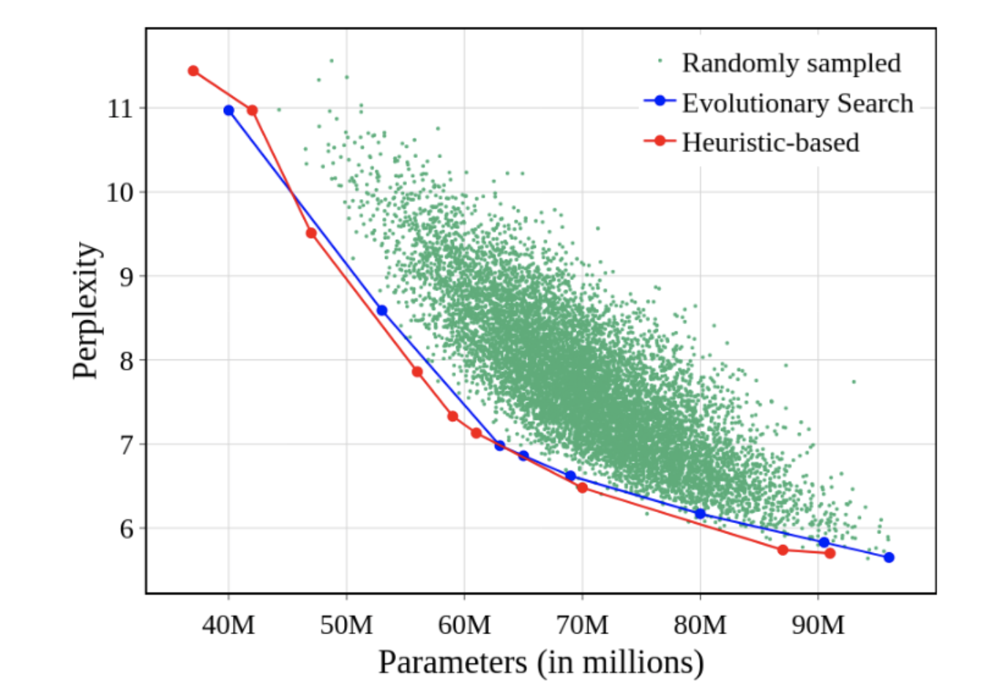
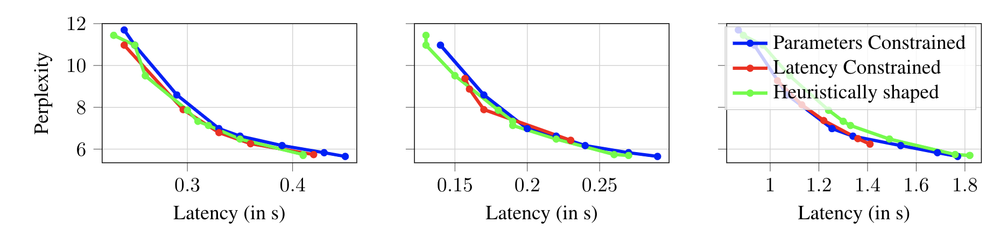

# SuperShaper: Task-Agnostic Super Pre-Training of BERT models with Variable Hidden Dimensions [[arXiv]]() [[Slides]]() [[Video]]()
This repository contains our PyTorch training code, evaluation code and pre-trained models for SuperShaper.

If you find this repo useful in your work, please consider citing our work:
```bibtex
```

## Super Pre-training with bottleneck layers
<p align="center">

</p>

## Competitive NLU performance

|           Model            | Params   | MNLI-M | QQP  | QNLI | CoLA | SST-2 | STS-B | RTE   | MRPC  |  Average GLUE  |
|:--------------------------:|:--------:|:------:|:----:|:----:|:----:|:-----:|:-----:|:-----:|:-----:|:--------------:|
|         LayerDrop          |  66M     |   80.7 | 88.3 | 88.4 | 45.4 | 90.7  | -     | 65.2  | 85.9  |      77.8      |
|         DistilBERT         |  66M     |   82.2 | 88.5 | 89.2 | 51.3 | 91.3  | 86.9  | 59.9  | 87.5  |      79.6      |
|         BERT-PKD           |  66M     |   81.5 | 70.7 | 89.0 |  -   | 92.0  | -     | 65.5  | 85.0  |      80.6      |
|         MiniLM             |  66M     |   84.0 | 91.0 | 91.0 | 49.2 | 92.0  | -     | 71.5  | 88.4  |      81.0      |
|         Ta-TinyBERT        |  67M     |   83.5 | 90.6 | 90.5 | 42.8 | 91.6  | 86.5  | 72.2  | 88.4  |      80.8      |
|         Tiny-BERT          |  66M     |   84.6 | 89.1 | 90.4 | 51.1 | 93.1  | 83.7  | 70.0  | 82.6  |      80.6      |
|         BERT-of-Theseus    |  66M     |   82.3 | 89.6 | 89.5 | 51.1 | 91.5  | 88.7  | 68.2  | -     |      80.1      |
|         PD-BERT            |  66M     |   82.5 | 90.7 | 89.4 |  -   | 91.1  | -     | 66.7  | 84.9  |      84.2      |
|         ELM                |  60M     |   84.2 | 91.1 | 90.8 | 54.2 | 92.7  | 88.9  | 72.2  | 89.0  |      82.9      |
|         NAS-BERT           |  60M     |   83.3 | 90.9 | 91.3 | 55.6 | 92.0  | 88.6  | 78.5  | 87.5  |      83.5      |
|         DynaBERT           |  60M     |   84.2 | 91.2 | 91.5 | 56.8 | 92.7  | 89.2  | 72.2  | 84.1  |      82.8      |
|         YOCO-BERT          |  59M-67M |   82.6 | 90.5 | 87.2 | 59.8 | 92.8  | -     | 72.9  | 90.3  |      82.3      |
|         SuperShaper (ours) |  63M     |   82.2 | 90.2 | 88.1 | 53.0 | 91.9  | 87.6  | 79.1  | 89.5  |      82.7      |


## Evolutionary Search and Simple Heuristics finds best subnetworks
<p align="center">

</p>

## Shape is insensitive to device-latency



## Quick Start
```
pip install -r requirements.txt
```
Install the required packages.

## Usage

We use [accelerate](https://huggingface.co/docs/accelerate/index.html) to train the transformers with no code changes on different setups (multi-gpu, TPU, etc)

### Configure your training setup
```bash
accelerate config                                       # answer questions wrt your training setup (multi-gpu, tpu, fp16 etc)

accelerate config  --config_file <path to config>       # to create custom training setup for different tasks
```

### Run the code with accelerate launch

```bash
accelerate launch train_mlm.py <args>
```

### Pretraining on C4-realnews

Download the C4-realnews dataset from [huggingface datasets](https://huggingface.co/datasets/allenai/c4/tree/main/realnewslike) following the instructions  [here](https://github.com/allenai/allennlp/discussions/5056).


```bash
accelerate launch train_mlm.py \
--per_device_train_batch_size 128 \
--per_device_eval_batch_size 256 \
--gradient_accumulation_steps 2 \
--fp16 1 \
--max_seq_length 128 \
--mixing bert-bottleneck \
--max_train_steps 175214 \
--tokenized_c4_dir <path to tokenized c4 realnews directory> \
--model_name_or_path bert-base-cased \
--sampling_type random \
--sampling_rule sandwich \
--learning_rate 5e-5 \
--weight_decay 0.0 \
--num_warmup_steps 0 \
--eval_random_subtransformers 1 \
--wandb_suffix <suffix>
```
To pretrain the supershaper backbone initialized with bert-base-cased model on C4-realnews dataset, we pre-tokenize the dataset and pass the correspinding path to `--tokenized_c4_dir`. You can also use the raw dataset and pass it with argument `--c4_dir <path to c4 realnews dataset>`.

To resume pretraining from a checkpoint, pass `--resume_from_checkpoint_dir <path to checkpoint>`

```bash
accelerate launch train_mlm.py \
--per_device_train_batch_size 128 \
--per_device_eval_batch_size 256 \
--gradient_accumulation_steps 2 \
--fp16 1 \
--max_seq_length 128 \
--mixing bert-bottleneck \
--max_train_steps 175214 \
--tokenized_c4_dir <path to tokenized c4 realnews directory> \
--model_name_or_path <model path> \
--sampling_type none \
--learning_rate 5e-5 \
--weight_decay 0.0 \
--num_warmup_steps 0 \
--eval_random_subtransformers 1 \
--subtransformer_config_path <path to subtransformer config> \
--wandb_suffix <suffix>
```
To train the supershaper subnetwork (a compressed model configuration with no sampling), use the --subtransformer_config_path argument. `subtransformer_configs/bert-bottleneck` folder contains different shape configrations discovered via evolutionary search/ heuristic method.

To further pretrain a subnetwork from supershaper checkpoint, use the `--model_name_or_path` and point to the checkpoint and set `--subtransformer_config_path` to the subnetwork configuration path. To pretrain the model from scratch without any checkpoint, use the --model_name_or_path as `bert-base-cased`.

### List of arguments for `train_mlm.py`:

```doc
usage: train_mlm.py [-h] [--dataset_name DATASET_NAME]
                    [--dataset_config_name DATASET_CONFIG_NAME]
                    [--train_file TRAIN_FILE]
                    [--validation_file VALIDATION_FILE]
                    [--validation_split_percentage VALIDATION_SPLIT_PERCENTAGE]
                    [--pad_to_max_length]
                    [--model_name_or_path MODEL_NAME_OR_PATH]
                    [--config_name CONFIG_NAME]
                    [--tokenizer_name TOKENIZER_NAME] [--use_slow_tokenizer]
                    [--per_device_train_batch_size PER_DEVICE_TRAIN_BATCH_SIZE]
                    [--per_device_eval_batch_size PER_DEVICE_EVAL_BATCH_SIZE]
                    [--learning_rate LEARNING_RATE]
                    [--weight_decay WEIGHT_DECAY]
                    [--num_train_epochs NUM_TRAIN_EPOCHS]
                    [--max_train_steps MAX_TRAIN_STEPS]
                    [--gradient_accumulation_steps GRADIENT_ACCUMULATION_STEPS]
                    [--lr_scheduler_type {linear,cosine,cosine_with_restarts,polynomial,constant,constant_with_warmup}]
                    [--num_warmup_steps NUM_WARMUP_STEPS]
                    [--output_dir OUTPUT_DIR] [--seed SEED]
                    [--model_type MODEL_TYPE] [--logging_steps LOGGING_STEPS]
                    [--max_seq_length MAX_SEQ_LENGTH]
                    [--line_by_line LINE_BY_LINE]
                    [--preprocessing_num_workers PREPROCESSING_NUM_WORKERS]
                    [--overwrite_cache OVERWRITE_CACHE]
                    [--mlm_probability MLM_PROBABILITY]
                    [--early_stopping_patience EARLY_STOPPING_PATIENCE]
                    [--layer_drop_prob LAYER_DROP_PROB]
                    [--eval_random_subtransformers EVAL_RANDOM_SUBTRANSFORMERS]
                    [--train_subtransformers_from_scratch TRAIN_SUBTRANSFORMERS_FROM_SCRATCH]
                    [--fp16 FP16] --mixing
                    {attention,gmlp,fnet,mobilebert,bert-bottleneck}
                    [--resume_from_checkpoint_dir RESUME_FROM_CHECKPOINT_DIR]
                    [--tiny_attn TINY_ATTN]
                    [--num_subtransformers_monitor NUM_SUBTRANSFORMERS_MONITOR]
                    [--c4_dir C4_DIR] [--tokenized_c4_dir TOKENIZED_C4_DIR]
                    [--sampling_type {none,naive_params,biased_params,random}]
                    [--sampling_rule {none,sandwich}] [--pop_size POP_SIZE]
                    --k_sampling K_SAMPLING
                    [--inplace_distillation INPLACE_DISTILLATION]
                    [--kd_ratio KD_RATIO]
                    [--layerwise_distillation LAYERWISE_DISTILLATION]
                    [--alpha_divergence ALPHA_DIVERGENCE]
                    [--alpha_min ALPHA_MIN] [--alpha_max ALPHA_MAX]
                    [--beta_clip BETA_CLIP]
                    [--subtransformer_config_path SUBTRANSFORMER_CONFIG_PATH]
                    [--rewire REWIRE]
                    [--rewired_model_checkpoint_dir REWIRED_MODEL_CHECKPOINT_DIR]
                    [--wandb_suffix WANDB_SUFFIX]
                    [--target_perplexity TARGET_PERPLEXITY]

Pretrain/Finetune a transformers model on a Masked Language Modeling task

optional arguments:
  -h, --help            show this help message and exit
  --dataset_name DATASET_NAME
                        The name of the dataset to use (via the datasets
                        library).
  --dataset_config_name DATASET_CONFIG_NAME
                        The configuration name of the dataset to use (via the
                        datasets library).
  --train_file TRAIN_FILE
                        A csv or a json file containing the training data.
  --validation_file VALIDATION_FILE
                        A csv or a json file containing the validation data.
  --validation_split_percentage VALIDATION_SPLIT_PERCENTAGE
                        The percentage of the train set used as validation set
                        in case there's no validation split
  --pad_to_max_length   If passed, pad all samples to `max_length`. Otherwise,
                        dynamic padding is used.
  --model_name_or_path MODEL_NAME_OR_PATH
                        Path to pretrained model or model identifier from
                        huggingface.co/models.
  --config_name CONFIG_NAME
                        Pretrained config name or path if not the same as
                        model_name
  --tokenizer_name TOKENIZER_NAME
                        Pretrained tokenizer name or path if not the same as
                        model_name
  --use_slow_tokenizer  If passed, will use a slow tokenizer (not backed by
                        the 🤗 Tokenizers library).
  --per_device_train_batch_size PER_DEVICE_TRAIN_BATCH_SIZE
                        Batch size (per device) for the training dataloader.
  --per_device_eval_batch_size PER_DEVICE_EVAL_BATCH_SIZE
                        Batch size (per device) for the evaluation dataloader.
  --learning_rate LEARNING_RATE
                        Initial learning rate (after the potential warmup
                        period) to use.
  --weight_decay WEIGHT_DECAY
                        Weight decay to use.
  --num_train_epochs NUM_TRAIN_EPOCHS
                        Total number of training epochs to perform.
  --max_train_steps MAX_TRAIN_STEPS
                        Total number of training steps to perform. If
                        provided, overrides num_train_epochs.
  --gradient_accumulation_steps GRADIENT_ACCUMULATION_STEPS
                        Number of updates steps to accumulate before
                        performing a backward/update pass.
  --lr_scheduler_type {linear,cosine,cosine_with_restarts,polynomial,constant,constant_with_warmup}
                        The scheduler type to use.
  --num_warmup_steps NUM_WARMUP_STEPS
                        Number of steps for the warmup in the lr scheduler.
  --output_dir OUTPUT_DIR
                        Where to store the final model.
  --seed SEED           A seed for reproducible training.
  --model_type MODEL_TYPE
                        Model type to use if training from scratch.
  --logging_steps LOGGING_STEPS
                        Log every X updates steps.
  --max_seq_length MAX_SEQ_LENGTH
                        The maximum total input sequence length after
                        tokenization. Sequences longer than this will be
                        truncated.
  --line_by_line LINE_BY_LINE
                        Whether distinct lines of text in the dataset are to
                        be handled as distinct sequences. This is deafult for
                        bert/electra models and should be set to False for
                        gpt/gpt2 type models
  --preprocessing_num_workers PREPROCESSING_NUM_WORKERS
                        The number of processes to use for the preprocessing.
  --overwrite_cache OVERWRITE_CACHE
                        Overwrite the cached training and evaluation sets
  --mlm_probability MLM_PROBABILITY
                        Ratio of tokens to mask for masked language modeling
                        loss
  --early_stopping_patience EARLY_STOPPING_PATIENCE
                        Patience for early stopping to stop training if
                        val_acc doesnt converge
  --layer_drop_prob LAYER_DROP_PROB
                        Probability to drop layers
  --eval_random_subtransformers EVAL_RANDOM_SUBTRANSFORMERS
                        If set to 1, this will evaluate 25 random
                        subtransformers after every training epoch when
                        training a supertransformer
  --train_subtransformers_from_scratch TRAIN_SUBTRANSFORMERS_FROM_SCRATCH
                        If set to 1, this will train 25 random subtransformers
                        from scratch. By default, it is set to False (0) and
                        we train a supertransformer and finetune
                        subtransformers
  --fp16 FP16           If set to 1, will use FP16 training.
  --mixing {attention,gmlp,fnet,mobilebert,bert-bottleneck}
                        specifies how to mix the tokens in bert-layers
  --resume_from_checkpoint_dir RESUME_FROM_CHECKPOINT_DIR
                        directory that contains checkpoints, optimizer,
                        scheduler to resume training
  --tiny_attn TINY_ATTN
                        Choose this if you need Tiny Attention Module along-
                        with gMLP dense block
  --num_subtransformers_monitor NUM_SUBTRANSFORMERS_MONITOR
                        Choose the number of subtransformers whose performance
                        you wish to monitor
  --c4_dir C4_DIR       The directory path for C4
  --tokenized_c4_dir TOKENIZED_C4_DIR
                        The directory path for tokenized C4
  --sampling_type {none,naive_params,biased_params,random}
                        The sampling type for super-transformer
  --sampling_rule {none,sandwich}
                        The sampling rule for sampling super-transformers
  --pop_size POP_SIZE   Number of random subtransformers to sample at each
                        step
  --k_sampling K_SAMPLING
                        The step frequency of sampling a sub-transformers
  --inplace_distillation INPLACE_DISTILLATION
                        Whether to use inplace distillation
  --kd_ratio KD_RATIO   Sensitizes the amount of KD-loss that needs to be
                        added with existing loss
  --layerwise_distillation LAYERWISE_DISTILLATION
                        Conditional layerwise attention and feature map
                        transfer for in-place distillation
  --alpha_divergence ALPHA_DIVERGENCE
                        Enable Alpha Divergence KL loss
  --alpha_min ALPHA_MIN
                        Alpha min value
  --alpha_max ALPHA_MAX
                        Alpha max value
  --beta_clip BETA_CLIP
                        The clip value for alpha divergence
  --subtransformer_config_path SUBTRANSFORMER_CONFIG_PATH
                        The path to a subtransformer configration
  --rewire REWIRE       Whether to rewire model
  --rewired_model_checkpoint_dir REWIRED_MODEL_CHECKPOINT_DIR
                        Path to rewired model checkpoint
  --wandb_suffix WANDB_SUFFIX
                        suffix for wandb
  --target_perplexity TARGET_PERPLEXITY
                        perplexity to stop further pretraining
```


### Finetuning on GLUE
```
accelerate launch train_glue.py \
--learning_rate=1e-05 \
--mixing=bert-bottleneck \
--model_name_or_path=<path to pretrained checkcpoint> \
--num_train_epochs=10 \
--per_device_train_batch_size=32 \
--sampling_type=none \
--task={cola,mnli,mrpc,qnli,qqp,rte,sst2,stsb,wnli} \
--wandb_suffix <suffix> \
--subtransformer_config_path <path to subtransformer config file>
```
^ Use this command to finetune on the GLUE benchmark.

For `MRPC, STS-B and RTE` we start finetuning using the mnli checkpoint as follows:
```
accelerate launch train_glue.py \
--learning_rate=1e-05 \
--mixing=bert-bottleneck \
--model_name_or_path=<path to mnli checkcpoint> \
--num_train_epochs=10 \
--per_device_train_batch_size=32 \
--is_mnli_checkpoint 1 \
--sampling_type=none \
--task={mrpc,rte,stsb} \
--wandb_suffix <suffix> \
--subtransformer_config_path <path to subtransformer config file>
```

### List of arguments for `train_glue.py`:
```doc
usage: train_glue.py [-h]
                     [--task_name {cola,mnli,mrpc,qnli,qqp,rte,sst2,stsb,wnli}]
                     [--train_file TRAIN_FILE]
                     [--validation_file VALIDATION_FILE]
                     [--max_length MAX_LENGTH] [--pad_to_max_length]
                     [--model_name_or_path MODEL_NAME_OR_PATH]
                     [--use_slow_tokenizer]
                     [--per_device_train_batch_size PER_DEVICE_TRAIN_BATCH_SIZE]
                     [--per_device_eval_batch_size PER_DEVICE_EVAL_BATCH_SIZE]
                     [--learning_rate LEARNING_RATE]
                     [--weight_decay WEIGHT_DECAY]
                     [--num_train_epochs NUM_TRAIN_EPOCHS]
                     [--max_train_steps MAX_TRAIN_STEPS]
                     [--gradient_accumulation_steps GRADIENT_ACCUMULATION_STEPS]
                     [--lr_scheduler_type {linear,cosine,cosine_with_restarts,polynomial,constant,constant_with_warmup}]
                     [--num_warmup_steps NUM_WARMUP_STEPS]
                     [--output_dir OUTPUT_DIR] [--seed SEED]
                     [--early_stopping_patience EARLY_STOPPING_PATIENCE]
                     [--eval_random_subtransformers EVAL_RANDOM_SUBTRANSFORMERS]
                     [--train_subtransformers_from_scratch TRAIN_SUBTRANSFORMERS_FROM_SCRATCH]
                     [--fp16 FP16] --mixing
                     {attention,gmlp,fnet,mobilebert,bert-bottleneck}
                     [--rewire REWIRE]
                     [--resume_from_checkpoint_dir RESUME_FROM_CHECKPOINT_DIR]
                     [--tiny_attn TINY_ATTN]
                     [--num_subtransformers_monitor NUM_SUBTRANSFORMERS_MONITOR]
                     [--debug]
                     [--sampling_type {none,naive_params,biased_params,random}]
                     [--subtransformer_config_path SUBTRANSFORMER_CONFIG_PATH]
                     [--wandb_suffix WANDB_SUFFIX]
                     [--is_mnli_checkpoint IS_MNLI_CHECKPOINT]
                     [--aug_train_file AUG_TRAIN_FILE]

Finetune a transformers model on a text classification task

optional arguments:
  -h, --help            show this help message and exit
  --task_name {cola,mnli,mrpc,qnli,qqp,rte,sst2,stsb,wnli}
                        The name of the glue task to train on.
  --train_file TRAIN_FILE
                        A csv or a json file containing the training data.
  --validation_file VALIDATION_FILE
                        A csv or a json file containing the validation data.
  --max_length MAX_LENGTH
                        The maximum total input sequence length after
                        tokenization. Sequences longer than this will be
                        truncated, sequences shorter will be padded if
                        `--pad_to_max_lengh` is passed.
  --pad_to_max_length   If passed, pad all samples to `max_length`. Otherwise,
                        dynamic padding is used.
  --model_name_or_path MODEL_NAME_OR_PATH
                        Path to pretrained model or model identifier from huggingface.co/models.
  --use_slow_tokenizer  If passed, will use a slow tokenizer (not backed by
                        the 🤗 Tokenizers library).
  --per_device_train_batch_size PER_DEVICE_TRAIN_BATCH_SIZE
                        Batch size (per device) for the training dataloader.
  --per_device_eval_batch_size PER_DEVICE_EVAL_BATCH_SIZE
                        Batch size (per device) for the evaluation dataloader.
  --learning_rate LEARNING_RATE
                        Initial learning rate (after the potential warmup
                        period) to use.
  --weight_decay WEIGHT_DECAY
                        Weight decay to use.
  --num_train_epochs NUM_TRAIN_EPOCHS
                        Total number of training epochs to perform.
  --max_train_steps MAX_TRAIN_STEPS
                        Total number of training steps to perform. If
                        provided, overrides num_train_epochs.
  --gradient_accumulation_steps GRADIENT_ACCUMULATION_STEPS
                        Number of updates steps to accumulate before
                        performing a backward/update pass.
  --lr_scheduler_type {linear,cosine,cosine_with_restarts,polynomial,constant,constant_with_warmup}
                        The scheduler type to use.
  --num_warmup_steps NUM_WARMUP_STEPS
                        Number of steps for the warmup in the lr scheduler.
  --output_dir OUTPUT_DIR
                        Where to store the final model.
  --seed SEED           A seed for reproducible training.
  --early_stopping_patience EARLY_STOPPING_PATIENCE
                        Patience for early stopping to stop training if
                        val_acc doesnt converge
  --eval_random_subtransformers EVAL_RANDOM_SUBTRANSFORMERS
                        If set to 1, this will evaluate 25 random
                        subtransformers after every training epoch when
                        training a supertransformer
  --train_subtransformers_from_scratch TRAIN_SUBTRANSFORMERS_FROM_SCRATCH
                        If set to 1, this will train 25 random subtransformers
                        from scratch. By default, it is set to False (0) and
                        we train a supertransformer and finetune
                        subtransformers
  --fp16 FP16           If set to 1, will use FP16 training.
  --mixing {attention,gmlp,fnet,mobilebert,bert-bottleneck}
                        specifies how to mix the tokens in bertlayers
  --rewire REWIRE       Whether to rewire model
  --resume_from_checkpoint_dir RESUME_FROM_CHECKPOINT_DIR
                        directory that contains checkpoints, optimizer,
                        scheduler to resume training
  --tiny_attn TINY_ATTN
                        Choose this if you need Tiny Attention Module along-
                        with gMLP dense block
  --num_subtransformers_monitor NUM_SUBTRANSFORMERS_MONITOR
                        Choose the number of subtransformers whose performance
                        you wish to monitor
  --debug               If passed, use 100 samples of dataset to quickly run
                        and check code.
  --sampling_type {none,naive_params,biased_params,random}
                        The sampling type for super-transformer
  --subtransformer_config_path SUBTRANSFORMER_CONFIG_PATH
                        The path to a subtransformer configration
  --wandb_suffix WANDB_SUFFIX
                        suffix for wandb
  --is_mnli_checkpoint IS_MNLI_CHECKPOINT
                        if model path is a pretrained mnli checkpoint
  --aug_train_file AUG_TRAIN_FILE
                        path to augmented train file
```
### Building Latency and Perplexity Predictors

We build perplexity and latency predictors to aid evolutionary search for faster fitness computation and constraining populations. An example to learn a latency predictor for a hardware is given below

```bash
cd search
PYTHONPATH=$PYTHONPATH:../ python predictor.py --input_file_name_or_path latency_data/k80/k80_latencies_seed42_bs128.csv --model_type xgb --output_file_name_or_path k80 --prediction_type latency
```

### List of arguments for `predictor.py`:

```doc
usage: predictor.py [-h] --input_file_name_or_path INPUT_FILE_NAME_OR_PATH
                         --prediction_type PREDICTION_TYPE
                         [--model_type MODEL_TYPE]
                         --output_file_name_or_path OUTPUT_FILE_NAME_OR_PATH
                         [--plot PLOT]

optional arguments:
  -h, --help            show this help message and exit
  --input_file_name_or_path INPUT_FILE_NAME_OR_PATH
                        The file name of the output
  --prediction_type PREDICTION_TYPE
                        The name of the dataset to use (via the datasets library).
  --model_type MODEL_TYPE
                        The type of cost model used. Options [xgb, lgbm]
  --output_file_name_or_path OUTPUT_FILE_NAME_OR_PATH
                        Path to store the learnt model
  --plot PLOT

```


### Evolutionary Search

An example to perform evolutionary search with perplexity constraints of 6 and latency constraints of 500ms is given below. Similarly, parameter constraints can also be provided using the appropriate flags shown in usage.

``` bash
cd search
PYTHONPATH=$PYTHONPATH:../ python evolution.py --perplexity_model_file_name_or_path outputs/perplexity_predictor.xgb --latency_model_file_name_or_path ./outputs/latency_predictors/1080Ti_latency_predictor.xgb --latency_constraints 0.5 --perplexity constraints 6 --model_type xgb
```

### List of arguments for `evolution.py`:

``` doc
usage: evolution.py [-h] [--perplexity_model_file_name_or_path PERPLEXITY_MODEL_FILE_NAME_OR_PATH]
                    [--latency_model_file_name_or_path LATENCY_MODEL_FILE_NAME_OR_PATH]
                    [--task TASK]
                    [--population_size POPULATION_SIZE]
                    [--parent_size PARENT_SIZE]
                    [--mutation_size MUTATION_SIZE]
                    [--crossover_size CROSSOVER_SIZE]
                    [--mutation_prob MUTATION_PROB]
                    [--time_budget TIME_BUDGET]
                    [--search_space_config SEARCH_SPACE_CONFIG]
                    [--params_constraints PARAMS_CONSTRAINTS]
                    [--latency_constraints LATENCY_CONSTRAINTS]
                    [--perplexity_constraints PERPLEXITY_CONSTRAINTS]
                    [--model_type MODEL_TYPE]
                    --device_type DEVICE_TYPE
optional arguments:
 -h, --help            show this help message and exit
  --perplexity_model_file_name_or_path PERPLEXITY_MODEL_FILE_NAME_OR_PATH
                        Path to load the predictor model
  --latency_model_file_name_or_path LATENCY_MODEL_FILE_NAME_OR_PATH
                        Path to load the latency model
  --task TASK           Task for evo-search
  --population_size POPULATION_SIZE
                        Population Size for Evo-Search
  --parent_size PARENT_SIZE
                        Parent Size
  --mutation_size MUTATION_SIZE
                        Mutation Size
  --crossover_size CROSSOVER_SIZE
                        Crossover Size
  --mutation_prob MUTATION_PROB
                        Mutation Probability
  --time_budget TIME_BUDGET
                        Max Time budget for Evolutionary Search
  --search_space_config SEARCH_SPACE_CONFIG
                        Search Space to use
  --params_constraints PARAMS_CONSTRAINTS
                        Constraints on Parameters
  --latency_constraints LATENCY_CONSTRAINTS
                        Constraints on Latency in seconds
  --perplexity_constraints PERPLEXITY_CONSTRAINTS
                        Constraints on Perplexity
  --model_type MODEL_TYPE
                        Cost model type
  --device_type DEVICE_TYPE
                        Device Type for outputs
```
